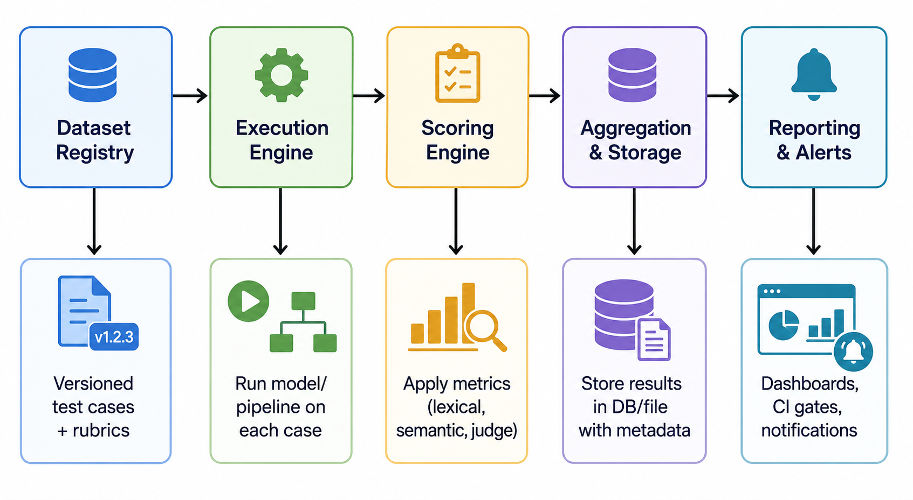

# 06. Evaluation Pipeline Design

> **Purpose** — Turn evaluation from a manual, ad-hoc activity into a **repeatable, automated system**. This section covers how to architect eval pipelines that integrate into your development workflow, CI/CD, and production monitoring.

---

## Table of Contents

- [Why Pipelines Matter](#why-pipelines-matter)
- [Pipeline Architecture](#pipeline-architecture)
- [Pipeline Stages](#pipeline-stages)
- [CI/CD Integration](#cicd-integration)
- [Versioning & Reproducibility](#versioning--reproducibility)
- [Experiment Tracking](#experiment-tracking)
- [Scheduling & Automation](#scheduling--automation)
- [Pipeline Patterns](#pipeline-patterns)
- [Tooling Options](#tooling-options)
- [Common Mistakes](#common-mistakes)
- [Key Takeaways](#key-takeaways)

---

## Why Pipelines Matter

Without a pipeline, evaluation looks like this:

```
Developer runs eval script locally → eyeballs results → ships
```

With a pipeline:

```
Code change → Automated eval suite → Score comparison → Gate → Deploy/Block → Monitor
```

The difference is **repeatability, consistency, and trust**. A pipeline ensures:

1. Every change is evaluated the same way
2. Results are tracked and comparable across time
3. Regressions are caught before they reach users
4. Evaluation is a first-class part of the development workflow

---

## Pipeline Architecture

### High-Level Architecture



### Component Responsibilities

| Component | Responsibility | Input | Output |
|---|---|---|---|
| **Dataset Registry** | Store and version eval datasets | Dataset files + metadata | Versioned test cases |
| **Execution Engine** | Run the system under test on each case | Test cases + system config | Raw outputs |
| **Scoring Engine** | Apply metrics to outputs | Outputs + references/rubrics | Per-case scores |
| **Aggregation** | Compute summary statistics | Per-case scores | Aggregate metrics |
| **Report Generator** | Create human-readable reports | Aggregate + per-case results | Reports, dashboards |
| **Storage** | Persist results for comparison | All artifacts | Queryable history |
| **Monitoring** | Alert on regressions | Current vs baseline scores | Alerts, CI pass/fail |

---

## Pipeline Stages

### Stage 1: Ingestion

Load and validate eval datasets.

| Task | Details |
|---|---|
| Load dataset | From registry, file system, or API |
| Validate schema | Ensure all required fields present (input, expected output, metadata) |
| Apply filters | Select specific slices, difficulty levels, or categories |
| Log metadata | Dataset version, case count, filter criteria |

### Stage 2: Test Case Preparation

Transform raw data into executable test cases.

| Task | Details |
|---|---|
| Template rendering | Insert case data into prompt templates |
| Context assembly | Attach retrieved documents, conversation history, etc. |
| Configuration | Set model parameters (temperature, max_tokens, model version) |
| Batching | Group cases for efficient parallel execution |

### Stage 3: Execution

Run the system under test.

| Task | Details |
|---|---|
| API calls | Send prompts to model/pipeline |
| Retries | Handle rate limits and transient failures |
| Timeout handling | Set maximum wait time per case |
| Output capture | Store raw response + metadata (latency, tokens, cost) |
| Concurrency | Parallel execution with configurable limits |

### Stage 4: Scoring

Apply evaluation metrics to each output.

| Scoring Type | Method | Example |
|---|---|---|
| **Rule-based** | Deterministic checks | Contains keyword, JSON valid, length in range |
| **Lexical** | String comparison metrics | ROUGE, BLEU, exact match |
| **Semantic** | Embedding-based similarity | BERTScore, cosine similarity |
| **Model-based** | LLM judge evaluation | Rubric scoring, faithfulness check |
| **Functional** | Execute and test output | Run generated code, validate SQL |

### Stage 5: Aggregation

Compute summary statistics across all cases.

| Aggregation | Description | Example |
|---|---|---|
| **Overall mean/median** | Central tendency of scores | Mean accuracy: 87.3% |
| **Per-category** | Scores by category/slice | Medical: 92%, Legal: 81% |
| **Distribution** | Score distribution analysis | P25=0.72, P50=0.88, P75=0.95 |
| **Failure analysis** | Cases below threshold | 12 cases scored < 0.5 |
| **Comparison** | Delta vs baseline/previous run | +2.1% vs v1.3 baseline |

### Stage 6: Reporting & Storage

Generate outputs and persist results.

| Output | Format | Audience |
|---|---|---|
| **CI/CD verdict** | Pass/fail + summary | Automated pipeline |
| **Detailed report** | HTML/Markdown with case-level details | Engineers |
| **Dashboard update** | Metrics pushed to monitoring | Team leads, PMs |
| **Alert** | Slack/email notification on regression | On-call |
| **Artifact storage** | JSON/Parquet with full results | Future comparison |

---

## CI/CD Integration

### Integration Points

| Trigger | When to Run | Eval Scope | Gate Behavior |
|---|---|---|---|
| **Pull Request** | Every PR that modifies prompts, models, or pipeline | Core regression set (fast, <5 min) | Block merge if regression detected |
| **Merge to main** | After PR merge | Full eval suite (15–30 min) | Alert on regression, don't block |
| **Scheduled (nightly)** | Every night | Full suite + adversarial + extended | Alert and create ticket |
| **Pre-release** | Before production deployment | Full suite + safety + production samples | Block deploy if thresholds not met |
| **Post-deploy** | After production rollout | Production monitoring + canary eval | Auto-rollback on critical regression |

### CI Pipeline Example (GitHub Actions)

```yaml
# .github/workflows/eval.yml
name: Eval Pipeline
on:
  pull_request:
    paths:
      - 'prompts/**'
      - 'src/pipeline/**'
      - 'eval/**'

jobs:
  eval:
    runs-on: ubuntu-latest
    steps:
      - uses: actions/checkout@v4
      - name: Run regression eval
        run: python eval/run.py --suite regression --baseline main
      - name: Check thresholds
        run: python eval/gate.py --min-accuracy 0.85 --max-regression 0.02
      - name: Upload results
        uses: actions/upload-artifact@v4
        with:
          name: eval-results
          path: eval/results/
```

### Gating Strategy

| Gate Type | Logic | When to Use |
|---|---|---|
| **Absolute threshold** | Score ≥ X | "Accuracy must be ≥ 85%" |
| **Relative threshold** | Score ≥ baseline - δ | "No more than 2% regression" |
| **Per-dimension gates** | All dimensions must pass | "Safety = 100% AND accuracy ≥ 85%" |
| **Trend-based** | No degradation over N runs | "No downward trend over 5 consecutive runs" |

---

## Versioning & Reproducibility

### What to Version

| Artifact | Why | How |
|---|---|---|
| **Eval datasets** | Cases change over time | Git + semantic versioning |
| **Scoring rubrics** | Rubric changes affect all scores | Git alongside datasets |
| **Judge prompts** | Prompt changes = score changes | Git + prompt registry |
| **Model configuration** | Temperature, model version, etc. | Config files in repo |
| **Pipeline code** | Scoring logic, aggregation | Standard code versioning |
| **Results** | For historical comparison | Timestamped artifact storage |

### Reproducibility Checklist

```
☐ Dataset version locked
☐ Model version and provider specified
☐ Temperature and sampling parameters fixed
☐ Judge model and prompt version recorded
☐ Random seed set (where applicable)
☐ Pipeline code version tagged
☐ Environment/dependency versions locked
```

---

## Experiment Tracking

Track eval experiments the same way you track ML experiments.

### What to Log Per Run

| Field | Example |
|---|---|
| Run ID | `eval-2025-06-24-001` |
| Dataset version | `customer_support_v2.1.0` |
| System version | `pipeline-v3.2 + gpt-4o-2025-05-13` |
| Config | `{temperature: 0.0, max_tokens: 1024}` |
| Aggregate scores | `{accuracy: 0.87, safety: 1.0, latency_p95: 2.1s}` |
| Per-case results | Full JSON with input/output/score/metadata |
| Duration | `14m 32s` |
| Cost | `$12.40` |

### Experiment Comparison Table

| Run | Date | Model | Accuracy | Safety | Latency P95 | Cost |
|---|---|---|---|---|---|---|
| eval-001 | Jun 20 | GPT-4o | 87.3% | 100% | 2.1s | $12.40 |
| eval-002 | Jun 22 | GPT-4o (new prompt) | 89.1% | 100% | 2.0s | $11.80 |
| eval-003 | Jun 24 | Claude 3.5 Sonnet | 88.5% | 100% | 1.8s | $9.20 |

---

## Scheduling & Automation

| Schedule | Purpose | Dataset | Action on Failure |
|---|---|---|---|
| **On every PR** | Catch regressions early | Core regression (50–100 cases) | Block merge |
| **Nightly** | Full regression + coverage | Full suite (500+ cases) | Alert + create ticket |
| **Weekly** | Extended + adversarial | Full + adversarial + safety | Team review |
| **Monthly** | Production distribution check | Fresh production samples | Dataset refresh |
| **On model update** | Validate new model version | Full suite | Block model swap if regression |

---

## Pipeline Patterns

### Pattern 1: Simple Sequential Pipeline

Best for small teams and single-model applications.

```
Load Dataset → Run Model → Score → Report
```

### Pattern 2: Parallel Multi-Model Pipeline

Compare multiple models or configurations simultaneously.

```
                ┌── Run Model A ── Score A ──┐
Load Dataset ──>├── Run Model B ── Score B ──├── Compare & Report
                └── Run Model C ── Score C ──┘
```

### Pattern 3: Layered Scoring Pipeline

Apply multiple scoring methods in order of cost.

```
Score with rules (free) → Score with embeddings (cheap) → Score with LLM judge (expensive)
                                                            ↑ only for cases that need it
```

### Pattern 4: Continuous Monitoring Pipeline

Run in production alongside live traffic.

```
Production Traffic → Sample 5% → Score Async → Store → Alert on Drift
```

---

## Tooling Options

| Need | Tool Options | Notes |
|---|---|---|
| **Pipeline orchestration** | Airflow, Dagster, Prefect, GitHub Actions | Choose based on existing infra |
| **Eval framework** | Promptfoo, Braintrust, DeepEval | See [02. Landscape](../02_landscape/README.md) |
| **Result storage** | PostgreSQL, BigQuery, Parquet files | Depends on query needs |
| **Dashboarding** | Grafana, Streamlit, custom HTML | Real-time vs periodic |
| **Alerting** | PagerDuty, Slack webhooks, email | Critical vs informational |
| **Experiment tracking** | MLflow, Weights & Biases, Braintrust | If you have many experiments |

---

## Common Mistakes

| Mistake | Consequence | Fix |
|---|---|---|
| **Manual eval only** | Inconsistent, slow, doesn't scale | Automate the core regression suite |
| **No baseline comparison** | Can't detect regressions | Always compare against a frozen baseline |
| **Running full suite on every PR** | Slow CI, developers ignore eval | Fast core set on PR, full suite nightly |
| **Not storing results** | Can't track trends or reproduce | Persist every run with full metadata |
| **Ignoring eval cost** | LLM judge calls get expensive | Layer scoring: cheap first, expensive only when needed |
| **No alerting** | Regressions go unnoticed | Automated alerts on threshold breaches |

---

## Key Takeaways

| Principle | Details |
|---|---|
| **Automate everything** | If it's not automated, it won't be run consistently |
| **Gate deployments** | Eval results should block bad deployments, not just inform |
| **Layer your pipeline** | Cheap checks first, expensive scoring only when needed |
| **Version all artifacts** | Datasets, rubrics, configs, results — all must be reproducible |
| **Track experiments** | Every eval run should be logged and comparable |
| **Start simple, grow** | Begin with a sequential pipeline, add complexity as needed |

---

Move to [07. LLM-as-a-Judge →](../07_llm_judge/README.md) to learn how to use LLMs as evaluation tools — including rubric design, calibration, and bias mitigation.
