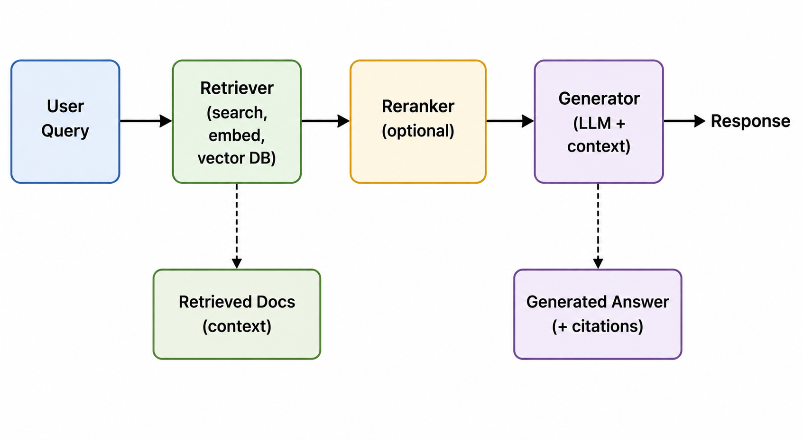

# 08. RAG Evals

> **Purpose** — Evaluate retrieval-augmented generation (RAG) systems end-to-end. RAG systems fail in unique ways — bad retrieval, unfaithful generation, missing citations — and each failure mode requires its own metrics. This section teaches you how to measure both retrieval quality and generation quality, and how to diagnose where failures originate.

---

## Table of Contents

- [RAG System Overview](#rag-system-overview)
- [Why RAG Evals Are Different](#why-rag-evals-are-different)
- [The RAG Eval Framework](#the-rag-eval-framework)
- [Retrieval Metrics](#retrieval-metrics)
- [Generation Metrics](#generation-metrics)
- [End-to-End Metrics](#end-to-end-metrics)
- [Component-Level vs End-to-End Eval](#component-level-vs-end-to-end-eval)
- [RAG Eval Frameworks & Tools](#rag-eval-frameworks--tools)
- [Building a RAG Eval Dataset](#building-a-rag-eval-dataset)
- [Diagnosing RAG Failures](#diagnosing-rag-failures)
- [Common Mistakes](#common-mistakes)
- [Key Takeaways](#key-takeaways)

---

## RAG System Overview



A RAG system has **two distinct failure surfaces**:
1. **Retrieval failure** — The right documents are not retrieved
2. **Generation failure** — The LLM doesn't use the retrieved documents correctly

You must evaluate both independently and together.

---

## Why RAG Evals Are Different

| Aspect | Standard LLM Eval | RAG Eval |
|---|---|---|
| **Components** | Single model | Retriever + (reranker) + generator |
| **Failure modes** | Hallucination, style, safety | Retrieval miss + context misuse + citation errors |
| **Ground truth** | Reference answer | Reference answer + relevant documents |
| **Attribution** | Which error? "Model was wrong" | Which component failed? Retrieval or generation? |
| **Metrics** | Accuracy, helpfulness | Context precision, faithfulness, answer relevance |

---

## The RAG Eval Framework

### Metrics Map

```
                    ┌─────────────────────────────────────────┐
                    │           RAG EVAL METRICS              │
                    ├───────────────┬─────────────────────────┤
                    │  RETRIEVAL    │     GENERATION          │
                    ├───────────────┼─────────────────────────┤
                    │ • Hit Rate    │ • Faithfulness          │
                    │ • MRR         │ • Answer Relevance      │
                    │ • NDCG        │ • Answer Correctness    │
                    │ • Context     │ • Citation Accuracy     │
                    │   Precision   │ • Completeness          │
                    │ • Context     │ • Groundedness          │
                    │   Recall      │                         │
                    └───────────────┴─────────────────────────┘
```

---

## Retrieval Metrics

Retrieval metrics measure whether the right documents are found and ranked well.

| Metric | What It Measures | Formula Intuition | Range | Best For |
|---|---|---|---|---|
| **Hit Rate (Recall@k)** | Is the relevant doc in the top-k results? | (queries with relevant doc in top-k) / total queries | 0–1 | Basic retrieval check |
| **MRR (Mean Reciprocal Rank)** | How high is the first relevant doc ranked? | Average of 1/rank_of_first_relevant_doc | 0–1 | Ranking quality |
| **NDCG@k** | Quality of the full ranking | Weighted relevance score normalized by ideal ranking | 0–1 | Multi-level relevance |
| **Context Precision** | What fraction of retrieved docs are relevant? | relevant_retrieved / total_retrieved | 0–1 | Noise in context |
| **Context Recall** | What fraction of relevant docs are retrieved? | relevant_retrieved / total_relevant | 0–1 | Coverage |
| **Map@k** | Average precision across queries | Mean of precision at each relevant doc position | 0–1 | Overall ranking quality |

### Interpreting Retrieval Metrics

| Score Range | Interpretation | Action |
|---|---|---|
| Hit Rate < 0.7 | Retriever misses relevant docs for >30% of queries | Fix embedding model, chunking strategy, or index |
| Context Precision < 0.5 | More than half of retrieved context is irrelevant noise | Improve reranking, reduce k, or refine embeddings |
| Context Recall < 0.8 | Missing important relevant documents | Increase k, improve chunking, or add metadata filters |
| MRR < 0.5 | Relevant docs consistently ranked low | Add reranker, improve embedding model |

### Key Retrieval Decisions

| Decision | Options | Tradeoff |
|---|---|---|
| **Top-k value** | k=3 vs k=5 vs k=10 | More docs = better recall but more noise + cost |
| **Chunk size** | 256 vs 512 vs 1024 tokens | Smaller = more precise, larger = more context |
| **Chunk overlap** | 0% vs 20% vs 50% | More overlap = fewer boundary misses but more redundancy |
| **Embedding model** | General vs domain-specific | Domain-specific = better for specialized content |

---

## Generation Metrics

Generation metrics measure how well the LLM uses the retrieved context.

| Metric | What It Measures | How It's Computed | Range |
|---|---|---|---|
| **Faithfulness** | Does the answer only use information from the retrieved context? | Decompose answer into claims → check each claim against context | 0–1 |
| **Groundedness** | Is every statement grounded in the provided sources? | Similar to faithfulness, may use NLI models | 0–1 |
| **Answer Relevance** | Does the answer address the user's question? | LLM judge rates relevance to the original query | 0–1 |
| **Answer Correctness** | Is the answer factually correct? | Compare against ground truth reference answer | 0–1 |
| **Citation Accuracy** | Are citations/references correct and complete? | Verify cited sources contain the claimed information | 0–1 |
| **Completeness** | Does the answer cover all aspects of the question? | Checklist of required points | 0–1 |
| **Hallucination Rate** | What fraction of claims are not in the context? | 1 - Faithfulness | 0–1 |

### Faithfulness Deep Dive

Faithfulness is the **most critical RAG-specific metric**. It measures whether the generated answer is grounded in the retrieved context (not whether the context is correct).

```
Step 1: Decompose the answer into individual claims
        "Paris is the capital of France. It has a population of 2.1 million."
        → Claim 1: "Paris is the capital of France"
        → Claim 2: "Paris has a population of 2.1 million"

Step 2: Check each claim against the retrieved context
        → Claim 1: Supported by Document 3 ✅
        → Claim 2: NOT found in any document ❌ (hallucination)

Step 3: Faithfulness = supported_claims / total_claims = 1/2 = 0.5
```

---

## End-to-End Metrics

| Metric | What It Measures | Components Tested |
|---|---|---|
| **Answer Accuracy** | Is the final answer correct? | Retrieval + Generation |
| **Task Success** | Did the system achieve the user's goal? | Full pipeline |
| **User Satisfaction** | Would the user be satisfied? | Full pipeline + UX |
| **Response Time** | Retrieval + generation latency | Full pipeline |
| **Cost per Query** | Embedding + LLM cost | Full pipeline |

---

## Component-Level vs End-to-End Eval

| Approach | What It Tells You | What It Misses |
|---|---|---|
| **Retrieval-only eval** | Whether the right documents are found | Whether the LLM uses them correctly |
| **Generation-only eval** | Whether the LLM generates good answers given context | Whether the context was good in the first place |
| **End-to-end eval** | Whether the whole system works | Which component failed |

### Recommended Strategy: Both

```
End-to-end answer is wrong
├── Check retrieval metrics
│   ├── Context Recall low → Retrieval failure (fix retriever)
│   └── Context Recall high → Generation failure (continue)
└── Check generation metrics
    ├── Faithfulness low → Hallucination (fix prompt/model)
    ├── Answer Relevance low → Off-topic (fix prompt)
    └── Faithfulness high + Relevance high → Reference answer may be wrong
```

---

## RAG Eval Frameworks & Tools

| Framework | Focus | Metrics Included | LLM Judge | Open-Source |
|---|---|---|---|---|
| **[Ragas](https://docs.ragas.io/)** | RAG-specific eval | Faithfulness, answer relevance, context precision/recall | ✅ | ✅ |
| **[DeepEval](https://docs.confident-ai.com/)** | General + RAG | Faithfulness, answer relevance, hallucination, bias | ✅ | ✅ |
| **[TruLens](https://www.trulens.org/)** | RAG tracing + eval | Groundedness, relevance, comprehensiveness | ✅ | ✅ |
| **[Arize Phoenix](https://phoenix.arize.com/)** | Tracing + eval | Retrieval metrics, LLM eval | ✅ | ✅ |
| **[LangSmith](https://smith.langchain.com/)** | LangChain ecosystem | Custom metrics, tracing | ✅ | ❌ |

### Ragas Metrics Mapping

| Ragas Metric | What It Tests | Component |
|---|---|---|
| `context_precision` | Relevance of retrieved chunks | Retrieval |
| `context_recall` | Coverage of relevant information | Retrieval |
| `faithfulness` | Answer grounded in context | Generation |
| `answer_relevancy` | Answer addresses the question | Generation |
| `answer_correctness` | Answer matches ground truth | End-to-end |
| `answer_similarity` | Semantic similarity to reference | End-to-end |

---

## Building a RAG Eval Dataset

### Required Fields

| Field | Description | Required? |
|---|---|---|
| `query` | The user's question | ✅ Always |
| `ground_truth_answer` | The correct reference answer | ✅ For correctness metrics |
| `relevant_documents` | The documents that contain the answer | ✅ For retrieval metrics |
| `retrieved_documents` | The documents actually retrieved (at eval time) | Generated during eval |
| `generated_answer` | The system's response (at eval time) | Generated during eval |
| `metadata` | Category, difficulty, source, etc. | Recommended |

### Dataset Construction Strategies

| Strategy | Method | When to Use |
|---|---|---|
| **Manual curation** | Domain experts write QA pairs from the knowledge base | Highest quality, small scale |
| **Synthetic generation** | LLM generates QA pairs from documents | Scale, coverage testing |
| **Production mining** | Extract real user queries + verified answers | Distribution matching |
| **Failure mining** | Collect cases where the system failed | Targeted improvement |

### Synthetic QA Generation Pipeline

```
1. Select a document chunk from your knowledge base
2. Prompt an LLM: "Generate 3 questions that can ONLY be answered using this text"
3. Generate reference answers from the chunk
4. Human-validate a 15-20% sample
5. Deduplicate by embedding similarity
6. Tag with metadata (topic, difficulty, multi-hop/single-hop)
```

---

## Diagnosing RAG Failures

### Failure Diagnosis Matrix

| Symptom | Retrieval Metrics | Generation Metrics | Root Cause | Fix |
|---|---|---|---|---|
| Wrong answer | Recall LOW | N/A | Retriever missed relevant docs | Fix embeddings, chunking, or k |
| Wrong answer | Recall HIGH | Faithfulness LOW | LLM hallucinated instead of using context | Fix prompt, add "answer from context only" |
| Wrong answer | Recall HIGH | Faithfulness HIGH | Context contains wrong information | Fix knowledge base, document quality |
| Incomplete answer | Recall PARTIAL | Completeness LOW | Some relevant docs missed | Increase k or improve retrieval |
| Irrelevant answer | Precision LOW | Relevance LOW | Too much noise in context | Add reranker, reduce k |
| No answer / refusal | Recall LOW | N/A | No relevant docs found | Check index coverage, query reformulation |
| Contradictory answer | Conflicting docs retrieved | N/A | Knowledge base inconsistency | Deduplicate/resolve conflicts in KB |

### Debugging Checklist

```
☐ Check retrieval: Are the right documents in the top-k?
☐ Check context quality: Are chunks well-formed and informative?
☐ Check faithfulness: Is the answer grounded in retrieved context?
☐ Check relevance: Does the answer address the actual question?
☐ Check citation: Are references accurate?
☐ Check for contradictions: Do retrieved docs conflict?
☐ Check chunk boundaries: Is relevant info split across chunks?
```

---

## Common Mistakes

| Mistake | Consequence | Fix |
|---|---|---|
| **Only measuring end-to-end accuracy** | Can't diagnose whether retrieval or generation failed | Eval both components separately |
| **Ignoring faithfulness** | High accuracy can mask hallucination problems | Always measure faithfulness alongside correctness |
| **Testing with simple single-hop questions only** | Misses multi-hop reasoning failures | Include multi-hop, comparison, and aggregation queries |
| **Not testing with adversarial context** | Misses context poisoning vulnerabilities | Add misleading documents to context |
| **Static eval set** | Misses new content in the knowledge base | Refresh eval set when KB is updated |
| **Evaluating without retrieval ground truth** | Can't measure retrieval quality | Annotate which documents are relevant per query |

---

## Key Takeaways

| Principle | Details |
|---|---|
| **Evaluate both retrieval AND generation** | End-to-end metrics alone can't tell you which component failed |
| **Faithfulness is the #1 RAG metric** | A correct answer that's hallucinated is a ticking time bomb |
| **Diagnose before fixing** | Use the failure diagnosis matrix to identify root causes |
| **Test multi-hop and edge cases** | Simple single-hop QA won't expose real-world failures |
| **Use RAG-specific tools** | Ragas, DeepEval, and TruLens have purpose-built metrics |
| **Keep eval sets fresh** | Update when the knowledge base changes |

---

Move to [09. Workflow Evals →](../09_workflow_evals/README.md) to learn how to evaluate multi-step chains, graph workflows, and state machine-based LLM systems.
