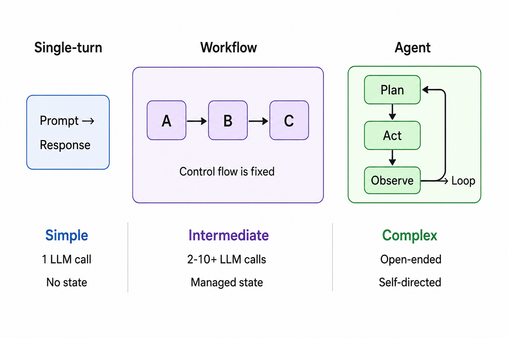

# 09. Workflow Evals

> **Purpose** — Evaluate multi-step LLM workflows: chains, graph-based pipelines, and state machines. Workflows sit between simple single-turn prompts and full autonomous agents. They introduce unique failure modes — transition errors, state corruption, path deviations — that require specialized evaluation techniques.

---

## Table of Contents

- [What Are LLM Workflows?](#what-are-llm-workflows)
- [Workflows vs Agents vs Single-Turn](#workflows-vs-agents-vs-single-turn)
- [Types of LLM Workflows](#types-of-llm-workflows)
- [What to Evaluate](#what-to-evaluate)
- [Workflow-Specific Metrics](#workflow-specific-metrics)
- [Evaluation Strategies](#evaluation-strategies)
- [Designing Workflow Eval Suites](#designing-workflow-eval-suites)
- [Common Failure Modes](#common-failure-modes)
- [Debugging Workflow Failures](#debugging-workflow-failures)
- [Common Mistakes](#common-mistakes)
- [Key Takeaways](#key-takeaways)

---

## What Are LLM Workflows?

A **workflow** is a deterministic or semi-deterministic sequence of LLM calls and operations, where the control flow is defined by the developer (not by the model).



---

## Workflows vs Agents vs Single-Turn

| Dimension | Single-Turn | Workflow | Agent |
|---|---|---|---|
| **Control flow** | None (one call) | Developer-defined | Model-decided |
| **Steps** | 1 | 2–10+ (fixed) | Variable (open-ended) |
| **State management** | None | Explicit, structured | Dynamic, model-managed |
| **Tool use** | Optional | Pre-defined per step | Model selects tools |
| **Determinism** | High (same prompt → similar output) | Medium (fixed flow, variable content) | Low (model plans its own path) |
| **Eval complexity** | Low | Medium | High |
| **Example** | "Summarize this text" | Extract → Validate → Format → Insert | "Research and write a report on X" |

---

## Types of LLM Workflows

| Type | Description | Example | Eval Focus |
|---|---|---|---|
| **Sequential chain** | Steps execute in order; output of step N feeds step N+1 | Extract entities → Classify → Generate report | Per-step quality + final output |
| **Branching workflow** | Conditional routing based on intermediate results | Classify query → route to specialist handler | Routing accuracy + branch quality |
| **Map-reduce** | Parallel execution on chunks, then aggregation | Summarize 10 docs independently → merge summaries | Per-chunk quality + merge quality |
| **Iterative refinement** | Loop: generate → evaluate → refine until threshold met | Draft → Critique → Revise (repeat up to 3x) | Improvement per iteration + convergence |
| **Graph workflow** | DAG of steps with complex dependencies | LangGraph, CrewAI pipelines | Node success + edge transitions |
| **State machine** | Explicit states with defined transitions | Customer service bot states (greet → diagnose → resolve → close) | State validity + transition correctness |

---

## What to Evaluate

### Evaluation Layers

```
Layer 1: NODE LEVEL      — Is each individual step producing correct output?
Layer 2: TRANSITION LEVEL — Is the right next step being triggered?
Layer 3: PATH LEVEL       — Is the overall execution path correct?
Layer 4: END-TO-END       — Does the workflow produce the correct final result?
```

### Metrics by Layer

| Layer | Metrics | How to Measure |
|---|---|---|
| **Node / Step** | Step accuracy, step latency, step cost | Evaluate each step's output independently |
| **Transition** | Routing accuracy, condition correctness | Check if the correct branch/next-step was triggered |
| **Path** | Path correctness, path length, unnecessary steps | Compare actual execution path vs expected path |
| **End-to-End** | Task completion, final output quality, total latency, total cost | Evaluate the final output against success criteria |

---

## Workflow-Specific Metrics

| Metric | Definition | Formula Intuition | Range |
|---|---|---|---|
| **Node Success Rate** | % of steps that produce acceptable output | correct_steps / total_steps | 0–1 |
| **Transition Accuracy** | % of correct routing decisions | correct_transitions / total_transitions | 0–1 |
| **Path Correctness** | Did the workflow follow the expected execution path? | actual_path == expected_path | Binary |
| **Completion Rate** | % of workflows that reach the terminal state | completed / total | 0–1 |
| **Path Efficiency** | Did the workflow take unnecessary detours? | optimal_steps / actual_steps | 0–1 |
| **State Consistency** | Is the workflow state valid at each step? | valid_states / total_states | 0–1 |
| **Error Propagation** | How often does one step's error cascade to later steps? | cascaded_errors / total_errors | 0–1 |
| **Recovery Rate** | When an error occurs, does the workflow recover? | recovered_errors / total_errors | 0–1 |

---

## Evaluation Strategies

### Strategy 1: Per-Step Unit Testing

Evaluate each node independently with controlled inputs.

```python
# Pseudocode
def test_extraction_step():
    input_doc = load_test_doc("contract_01")
    result = extraction_step(input_doc)
    assert "effective_date" in result
    assert result["effective_date"] == "2025-01-15"
    assert result["parties"] == ["Acme Corp", "Widget LLC"]
```

**Best for**: Catching individual step regressions early.

### Strategy 2: Snapshot Testing

Record a known-good execution trace and compare against it.

```
Expected trace:  A → B → C (branch: positive) → D → output
Actual trace:    A → B → C (branch: negative) → E → output  ← DEVIATION at C
```

**Best for**: Detecting unintended path changes after code/prompt updates.

### Strategy 3: End-to-End Golden Set

Run full workflows on curated test cases and evaluate final output.

| Test Case | Input | Expected Output | Actual Output | Score |
|---|---|---|---|---|
| Case 001 | "Analyze Q3 earnings for AAPL" | Revenue, EPS, guidance summary | ✅ Correct | 4.5/5 |
| Case 002 | "Compare MSFT and GOOG margins" | Side-by-side comparison table | ❌ Missing GOOG data | 2/5 |

**Best for**: Validating that the full pipeline delivers the right result.

### Strategy 4: Trace-Level Evaluation

Log every intermediate state and evaluate transitions.

```json
{
  "trace_id": "wf-001",
  "steps": [
    {"node": "extract", "input": "...", "output": "...", "latency_ms": 450, "score": 0.95},
    {"node": "classify", "input": "...", "output": "positive", "latency_ms": 200, "score": 1.0},
    {"node": "generate", "input": "...", "output": "...", "latency_ms": 800, "score": 0.88}
  ],
  "path": ["extract", "classify", "generate"],
  "total_latency_ms": 1450,
  "final_score": 0.92
}
```

**Best for**: Debugging which step caused a final-output failure.

---

## Designing Workflow Eval Suites

### Test Case Categories

| Category | Purpose | Example |
|---|---|---|
| **Happy path** | Verify standard execution flow | Normal user query → standard processing |
| **Branch coverage** | Test each conditional branch | Inputs that trigger each routing decision |
| **Error handling** | Verify graceful failure | Invalid input at step 2 → should skip, not crash |
| **Edge cases** | Test boundary conditions | Empty input, extremely long input, conflicting data |
| **Regression** | Catch regressions from past bugs | Cases that previously failed |
| **State mutation** | Verify state is correctly updated | Check state at each transition point |

### Recommended Coverage

| Workflow Type | Minimum Test Cases | Key Coverage Areas |
|---|---|---|
| Sequential (3–5 steps) | 20–50 cases | Per-step + end-to-end |
| Branching (3+ branches) | 10+ per branch | Branch routing + each branch path |
| Map-reduce | 10–20 cases with varying sizes | Chunk quality + merge quality |
| Iterative | 15–30 cases | Convergence + max-iteration behavior |
| State machine | 5+ per state transition | All transitions + invalid transitions |

---

## Common Failure Modes

| Failure Mode | Description | Detection | Prevention |
|---|---|---|---|
| **Error propagation** | Step 2's error cascades through steps 3, 4, 5 | Compare per-step scores across the trace | Add validation gates between steps |
| **Wrong routing** | Conditional branch takes the wrong path | Check routing decisions against expected paths | Improve classification step, add confidence thresholds |
| **State corruption** | Intermediate state becomes invalid or inconsistent | Validate state schema at each transition | Add state validation middleware |
| **Infinite loops** | Iterative workflow never converges | Monitor iteration count, set hard max | Add convergence criteria + max iteration limit |
| **Context window overflow** | Accumulated context exceeds model limits | Track token count at each step | Summarize/truncate context between steps |
| **Partial completion** | Workflow stops early without completing all steps | Check for terminal state + all required outputs | Add completion validation |
| **Merge conflicts** | Map-reduce merge produces contradictory results | Evaluate merge output for consistency | Add conflict resolution logic |

---

## Debugging Workflow Failures

### Diagnostic Flowchart

```
Final output is wrong
│
├── Which step introduced the error?
│   ├── Check per-step scores in the trace
│   ├── Find first step with score below threshold
│   └── Root cause is likely at or before that step
│
├── Was the path correct?
│   ├── Compare actual path vs expected path
│   ├── If path diverged → routing/classification issue
│   └── If path correct → content quality issue at a specific step
│
└── Was state corrupted?
    ├── Validate state schema at each transition
    ├── Check for missing or null fields
    └── If corrupted → add state validation middleware
```

---

## Common Mistakes

| Mistake | Consequence | Fix |
|---|---|---|
| **Only testing end-to-end** | Can't diagnose which step failed | Add per-step evaluation |
| **Not testing all branches** | Hidden bugs in untested paths | Ensure branch coverage |
| **Ignoring error propagation** | One bad step ruins the entire workflow | Add validation gates between steps |
| **No trace logging** | Can't debug failures after the fact | Log all intermediate states |
| **Not testing failure paths** | System crashes on invalid input | Test error handling and graceful degradation |
| **Testing only with short inputs** | Misses context window overflow issues | Test with realistic input sizes |

---

## Key Takeaways

| Principle | Details |
|---|---|
| **Evaluate every layer** | Node, transition, path, and end-to-end — each reveals different failures |
| **Log full traces** | You can't debug what you can't see; log every intermediate state |
| **Test all branches** | Untested branches are untested code |
| **Watch for error propagation** | One failing step can cascade through the entire workflow |
| **Add validation gates** | Catch errors between steps before they propagate |
| **Many real systems are workflows** | If you're chaining LLM calls, workflow evals apply to you |

---

Move to [10. Agent Evals →](../10_agent_evals/README.md) to learn how to evaluate autonomous agents — systems that plan, act, observe, and iterate on their own.
