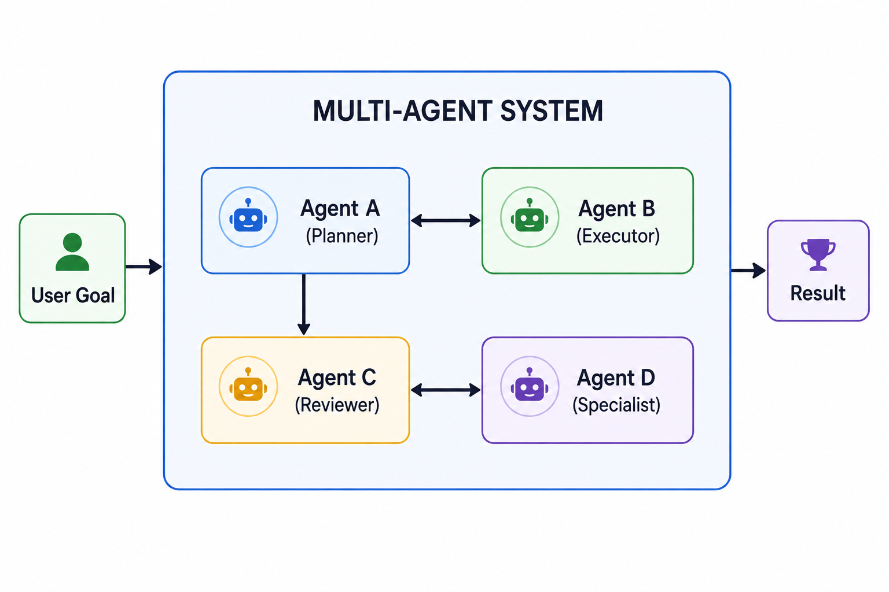

# 11. Multi-Agent Evals

> **Purpose** — Evaluate systems where multiple LLM agents coordinate, delegate, communicate, and collaborate to accomplish goals. Multi-agent systems introduce emergent behaviors and failure modes — delegation errors, communication breakdowns, role confusion — that don't exist in single-agent setups.

---

## Table of Contents

- [What Are Multi-Agent Systems?](#what-are-multi-agent-systems)
- [Multi-Agent Architectures](#multi-agent-architectures)
- [What to Evaluate](#what-to-evaluate)
- [Multi-Agent Metrics](#multi-agent-metrics)
- [Delegation Evaluation](#delegation-evaluation)
- [Communication Evaluation](#communication-evaluation)
- [Coordination Patterns](#coordination-patterns)
- [Conflict Resolution](#conflict-resolution)
- [MCP Ecosystems](#mcp-ecosystems)
- [Common Failure Modes](#common-failure-modes)
- [Evaluation Strategies](#evaluation-strategies)
- [Common Mistakes](#common-mistakes)
- [Key Takeaways](#key-takeaways)

---

## What Are Multi-Agent Systems?

A multi-agent system uses two or more LLM-powered agents that interact to accomplish a shared or distributed goal.



---

## Multi-Agent Architectures

| Architecture | Description | Example | Eval Focus |
|---|---|---|---|
| **Supervisor** | One agent orchestrates others | Manager delegates to researcher + coder + reviewer | Delegation quality, task allocation |
| **Peer-to-peer** | Agents communicate directly as equals | Debate between two agents to reach consensus | Communication quality, consensus |
| **Hierarchical** | Multi-level delegation tree | CEO → VPs → workers | Cascade correctness, span of control |
| **Swarm** | Many simple agents with emergent behavior | Parallel web scrapers with shared findings | Coordination, deduplication |
| **Pipeline** | Agents pass work sequentially | Writer → Editor → Fact-checker → Publisher | Handoff quality, interface adherence |
| **Debate/Adversarial** | Agents argue opposing positions | Pro/con agents debating a decision | Argument quality, final synthesis |

---

## What to Evaluate

### Evaluation Layers

```
Layer 1: INDIVIDUAL AGENT    — Does each agent perform its role well?
Layer 2: INTERACTION         — Are inter-agent communications effective?
Layer 3: COORDINATION        — Does the team achieve the goal together?
Layer 4: EMERGENT BEHAVIOR   — Are there unintended system-level effects?
```

---

## Multi-Agent Metrics

### Individual Agent Metrics

| Metric | Definition | How to Measure |
|---|---|---|
| **Role adherence** | Does each agent stay within its assigned role? | LLM judge checks for role violations |
| **Task quality** | Does each agent produce good outputs for its sub-tasks? | Standard per-task quality metrics |
| **Instruction compliance** | Does each agent follow the supervisor's instructions? | Compare actions to instructions |

### Interaction Metrics

| Metric | Definition | How to Measure |
|---|---|---|
| **Message clarity** | Are inter-agent messages clear and actionable? | LLM judge rates message quality |
| **Information loss** | Is important information lost in handoffs? | Compare information before/after handoff |
| **Handoff completeness** | Does the sending agent include all necessary context? | Checklist of required handoff fields |
| **Protocol compliance** | Do agents follow the communication protocol? | Rule-based validation of message format |

### Coordination Metrics

| Metric | Definition | Formula Intuition |
|---|---|---|
| **End-to-end task completion** | Does the system achieve the overall goal? | Binary or partial credit |
| **Delegation success rate** | % of delegated tasks completed correctly | correct_delegations / total_delegations |
| **Coordination efficiency** | How much overhead does coordination add? | total_agent_time / single_agent_baseline |
| **Conflict resolution rate** | When agents disagree, is it resolved correctly? | resolved_conflicts / total_conflicts |
| **Redundancy rate** | How much duplicate work occurs? | duplicate_actions / total_actions |
| **Bottleneck rate** | How often does one agent block others? | blocked_time / total_time |

### System-Level Metrics

| Metric | Definition | Healthy Range |
|---|---|---|
| **Total latency** | Wall-clock time for the full task | Depends on task complexity |
| **Total cost** | Sum of all agent LLM + tool costs | Budget-dependent |
| **Message count** | Total inter-agent messages | Lower is generally better |
| **Token overhead** | Tokens spent on coordination vs actual work | < 30% on coordination |

---

## Delegation Evaluation

### What Makes Good Delegation?

| Criterion | Good Delegation | Bad Delegation |
|---|---|---|
| **Task clarity** | "Search for Q3 revenue for AAPL from SEC filings" | "Look up some financial info" |
| **Scope** | Right-sized for the delegate's capabilities | Too broad or too narrow |
| **Context** | Includes all necessary background | Assumes context the delegate doesn't have |
| **Success criteria** | Clear definition of done | No way to know when the task is complete |
| **Authority** | Delegate has the tools/permissions needed | Assigns task that delegate can't execute |

### Delegation Scoring Rubric

| Score | Description |
|---|---|
| **5** | Task perfectly scoped, clear instructions, all context provided, delegate has required capabilities |
| **4** | Good delegation with minor clarity issues that don't affect outcome |
| **3** | Adequate but missing some context; delegate needs to ask clarifying questions |
| **2** | Poorly scoped or assigned to wrong agent; requires significant interpretation |
| **1** | Unintelligible, impossible, or assigned to an agent without required tools |

---

## Communication Evaluation

### Message Quality Dimensions

| Dimension | What to Check | Example of Good | Example of Bad |
|---|---|---|---|
| **Relevance** | Message contains information the receiver needs | "Found 3 relevant papers on topic X" | "Here's everything I found" (dumps everything) |
| **Conciseness** | Not unnecessarily verbose | Structured summary of findings | Full copy-paste of all search results |
| **Actionability** | Receiver can act on the message | "Proceed with approach B, here's why..." | "I'm not sure what to do" |
| **Completeness** | All necessary information included | Includes data, source, confidence | Omits key findings |

### Communication Anti-Patterns

| Anti-Pattern | Description | Impact |
|---|---|---|
| **Telephone game** | Information degrades through multiple handoffs | Final agent gets distorted information |
| **Echo chamber** | Agents reinforce each other's errors | Systematic bias goes uncorrected |
| **Deadlock** | Two agents wait for each other | Task never completes |
| **Flooding** | Agent sends too many messages | Receiver's context window overwhelmed |
| **Role creep** | Agent starts doing another agent's job | Duplicate work, inconsistency |

---

## Coordination Patterns

### Pattern Comparison

| Pattern | How It Works | Strengths | Weaknesses |
|---|---|---|---|
| **Sequential handoff** | A finishes → passes to B → B finishes → passes to C | Simple, easy to debug | Slow, bottleneck at each stage |
| **Parallel dispatch** | Supervisor sends tasks to A, B, C simultaneously | Fast, good for independent sub-tasks | Hard to handle dependencies |
| **Iterative refinement** | A drafts → B critiques → A revises → B approves | High quality output | Slow, may not converge |
| **Voting/consensus** | Multiple agents solve independently, majority wins | Robust, reduces individual errors | Expensive (N× cost) |
| **Specialist routing** | Router agent directs queries to domain experts | Right expertise for each sub-task | Router accuracy is critical |

---

## Conflict Resolution

When agents disagree, the system needs a resolution mechanism.

| Strategy | How It Works | Best For |
|---|---|---|
| **Supervisor override** | Supervisor picks the correct answer | Hierarchical systems |
| **Majority vote** | Take the most common answer among agents | Parallel/swarm systems |
| **Confidence-based** | Agent with highest confidence wins | When agents can self-assess |
| **Evidence-based** | Agent that provides the strongest evidence wins | Research/analysis tasks |
| **Escalation** | Unresolved conflicts escalated to human | High-stakes decisions |

### Evaluating Conflict Resolution

| Metric | Definition |
|---|---|
| **Resolution accuracy** | % of conflicts resolved correctly |
| **Resolution time** | Time from conflict detection to resolution |
| **Escalation rate** | % of conflicts that require human intervention |
| **False conflict rate** | % of "conflicts" that were actually agreements |

---

## MCP Ecosystems

The **Model Context Protocol (MCP)** enables agents to discover and use tools/resources from external servers. This creates a dynamic multi-agent ecosystem.

### MCP-Specific Eval Concerns

| Concern | What to Evaluate | How |
|---|---|---|
| **Server discovery** | Does the agent find the right MCP servers? | Track server selection accuracy |
| **Tool compatibility** | Are tool schemas correctly interpreted? | Validate tool call arguments |
| **Context management** | Is context from multiple servers integrated coherently? | Check for contradictions/duplications |
| **Permission handling** | Does the agent respect authorization boundaries? | Test with restricted tools |
| **Fallback behavior** | What happens when an MCP server is unavailable? | Test with server failures |

---

## Common Failure Modes

| Failure Mode | Description | Detection | Mitigation |
|---|---|---|---|
| **Delegation to wrong agent** | Task assigned to agent without required capability | Compare agent capabilities vs task requirements | Explicit capability registry |
| **Communication breakdown** | Critical information lost between agents | Track information completeness across handoffs | Structured message protocols |
| **Coordination deadlock** | Agents wait for each other indefinitely | Timeout monitoring | Set maximum wait times |
| **Role confusion** | Agent performs actions outside its role | Monitor for role violations | Clear role definitions + enforcement |
| **Echo chamber** | Agents amplify each other's errors | Cross-validate with external source | Add independent verification step |
| **Cascading failure** | One agent's failure cascades through the system | Track error propagation across agents | Isolation + fallback strategies |
| **Token budget exhaustion** | Coordination messages consume the context window | Monitor token usage per agent | Summarize inter-agent messages |
| **Social loafing** | Some agents contribute little while others do all work | Track per-agent contribution | Explicit task accountability |

---

## Evaluation Strategies

### Strategy 1: End-to-End Black Box

Evaluate only the final system output.

| Pros | Cons |
|---|---|
| Simple to implement | Can't diagnose inter-agent issues |
| Matches user experience | No visibility into coordination quality |

### Strategy 2: Agent-Level + System-Level

Evaluate each agent independently AND the system as a whole.

| Pros | Cons |
|---|---|
| Identifies weak agents | More complex setup |
| Actionable improvement signals | Doesn't capture interaction quality |

### Strategy 3: Full Trace Evaluation (Recommended)

Log and evaluate all inter-agent communications + individual actions + final output.

```json
{
  "task_id": "multi-001",
  "agents": ["planner", "researcher", "coder", "reviewer"],
  "messages": [
    {"from": "planner", "to": "researcher", "content": "Find...", "quality": 4.5},
    {"from": "researcher", "to": "coder", "content": "Here are...", "quality": 3.8}
  ],
  "per_agent_scores": {"planner": 0.9, "researcher": 0.85, "coder": 0.92, "reviewer": 0.88},
  "coordination_overhead": "22%",
  "task_completion": true,
  "total_latency": "34s",
  "total_cost": "$0.82"
}
```

---

## Common Mistakes

| Mistake | Consequence | Fix |
|---|---|---|
| **Only measuring final output** | Can't identify which agent or interaction failed | Log and evaluate full traces |
| **Not testing with agent failures** | System appears robust but crumbles on errors | Simulate individual agent failures |
| **Ignoring coordination overhead** | System is correct but too slow/expensive | Track token + latency overhead from coordination |
| **No role enforcement** | Agents step on each other's tasks | Define and enforce clear role boundaries |
| **Assuming more agents = better** | Coordination overhead can exceed benefits | Benchmark multi-agent vs single-agent baseline |

---

## Key Takeaways

| Principle | Details |
|---|---|
| **Evaluate at all layers** | Individual agents, interactions, coordination, and system-level |
| **Delegation quality is critical** | Bad delegation guarantees bad results regardless of agent quality |
| **Communication is a failure surface** | Information loss, flooding, and deadlocks are real risks |
| **Benchmark against single-agent** | Multi-agent is only better if coordination overhead is justified |
| **Log full traces** | You can't debug inter-agent issues without full communication logs |
| **Test failure resilience** | What happens when one agent goes down? |

---

Move to [12. Tool Calling Evals →](../12_tool_calling_evals/README.md) to learn how to evaluate function calling, API selection, and parameter accuracy.
